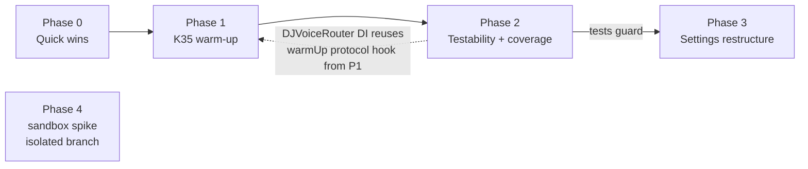

# Patter Codebase-Improvement Pass

## Context

A three-way senior Swift review (Services / Views+VMs+Models / Tests+config) surfaced ~40 findings. User-approved scope: **code-quality refactors, K35 warm-up fix, test coverage, macOS app-sandbox re-enable spike**. Out of scope: localization, backlog features (album detail, thumbs sync, AirPlay, persona UX), K34/K5 (documented-accepted).

All draft claims were re-verified against the code. Key facts driving the plan:

- **K35 (open, high):** `SystemDJVoice` already reuses one `AVSpeechSynthesizer` (stored property, `usesApplicationAudioSession = false` on iOS — the tracker's K35 entry predates this; commit `9779040` shipped the warm synth). The residual gap: `RootView.handleReady` pre-warms DJBrain (`RootView.swift:135`) and Kokoro (`:143-147`) but never SystemDJVoice — the first render still pays the AU IPC handshake + voice-model load.
- `SettingsView.swift` is 742 lines with `AVAudioPlayer` preview logic in the view; `SettingsViewModel.swift` (385 ln) mixes settings persistence, persona CRUD, and an inline OPML parser; heavy duplication with `PreferencesWizardView` (suggested-feed rows, installed-voice enumeration, iOS-26 provider filter).
- Zero tests: `TrackFeedbackStore`, `SettingsViewModel`, `DJVoiceRouter` fallback paths. The router hardcodes concrete provider types (`DJVoiceRouter.swift:22-24`), so fallback-to-system is untestable as written.
- `project.yml:72` has `com.apple.security.app-sandbox: false` (K30 rollback). K30 was a spurious diagnosis — the IPC errors were iOS, not macOS — so macOS sandbox breakage was never actually confirmed. Blocks Mac App Store.

## Execution-environment caveat (important)

This session runs in a **Linux container — no Xcode, no xcodebuild**. Swift/SwiftUI/MusicKit code cannot be compiled or tested here. Consequences:

- All "tests green" gates below mean: *commits are structured so Andrew can run `xcodebuild test -scheme Patter -destination 'platform=macOS'` per commit locally* (currently 35 tests). The PR will be a draft and will state explicitly that the suite was not run in-session.
- Phase 1's iPhone smoke, Phase 3's manual Settings run-through, and Phase 4's macOS app smoke were always Andrew-side; Phase 4 here is *prepared* (branch + entitlement flip + test checklist committed), verdict deferred to a local run.
- Bias every commit toward small, independently revertable changes — if one fails to compile locally, it can be dropped without taking the rest.

## Constraints

- macOS test suite must pass after every commit (run locally by Andrew; 35 → ~60 tests expected)
- Conventional commits (`refactor:`, `feat:`, `test:`, `build:` — see AGENTS.md); smallest-blast-radius bias (K31 lesson)
- Swift 6 strict concurrency — no new `@unchecked Sendable` / `nonisolated(unsafe)`; the Fakes work *removes* three
- `xcodegen generate` only after `project.yml` edits (Phase 4 only)

## Phase dependency shape

Phase 4 is independent (own branch); Phases 0→3 are sequential on main's feature branch.

---

## Phase 0 — Quick wins (zero behavior change, ~6 commits)

1. `Patter/Services/MusicKitService.swift` — delete dead `asTrack` extension (`:339-348`, zero call sites, verified by grep); hoist the ×4-repeated `items.count >= 24` cap (`:225,238,250,252`) to `private static let sectionFetchLimit = 24`.
2. `Patter/Services/DJVoiceProtocol.swift:5` — fix stale doc: says "renders to a local .caf file" but providers return `.caf` (system), `.mp3` (OpenAI), `.wav` (Kokoro). Reword to "a local audio file".
3. `Patter/Views/QueueView.swift:16` — replace `vm.remove(at: $0.first!)` with `if let first = $0.first`.
4. `Patter/Services/PlaybackCoordinator.swift` (`monitorTrackUntilEnd`, `:351-424`) — name the magic numbers as `static let` tuning constants with one-line why-comments: 500 ms poll interval (`:362`), 35.0 s willAdvance lead (`:394` — why-comment already exists at `:387-393`, move it to the constant), 1.5 s advance-timer pad (`:408`), 10 s / 1.0 s playback-reset detection thresholds (`:414`). **Constants only — no logic or extraction changes** (this is the most device-verified fragile code; see Cuts).
5. `Patter/Services/Producer.swift` — split `shouldGenerate()` (`:258-276`) into a pure predicate + explicit state mutation at the call site (`primeSegment:279`); name `wordsPerMinute = 130` (`:337`). *(The `:315` fallback-title cleanup moves to Phase 2 item 3 — `cleanTitle` is currently `private` on `DJBrain` and Producer only holds `any DJBrainProtocol`, so it needs the shared extraction first.)*
6. `Patter/Models/DJPersona.swift` — one `static let defaultVoicePreset = "com.apple.voice.enhanced.en-US.Samantha"` for the string repeated in all four built-ins (`:22,29,36,43`).
7. New `Patter/Utilities/TimeFormatting.swift` (Utilities dir exists — `Keychain.swift` lives there) — shared m:ss formatter; adopt in `MiniPlayerBar.swift:180-186` (`formatTime`) and `NowPlayingView.swift:100-104` (`format`).
8. `TTSProvider.available` static (in `DJVoiceRouter.swift` where the enum lives) — encapsulate the iOS-26 Kokoro filter duplicated as `availableTTSProviders` in `SettingsView.swift:466-473` and `PreferencesWizardView.swift:371-378`; keep the K6/K24/K26 comment on the static.
9. Trivial: drop redundant `await MainActor.run` in `NowPlayingViewModel.swift:91-105` and `QueueViewModel.swift:24-27` (both classes are `@MainActor`; their `Task {}` closures inherit the actor, so the hop is a no-op — also delete the now-wrong "outside the MainActor hop" comment at `NowPlayingViewModel.swift:82-83`); cache `installedEnglishVoices` (`PreferencesWizardView.swift:170-179`, recomputed every body render) into `@State` populated `onAppear`.

**Gate:** each item is its own commit; suite stays at 35 green.

## Phase 1 — K35: SystemDJVoice launch warm-up (~2 commits)

1. `Patter/Services/DJVoiceProtocol.swift` — add `func warmUp(voiceIdentifier: String) async` with a default no-op in a protocol extension. (This is also what lets Phase 2's DI keep the router's warm-up proxy working against `any DJVoiceProtocol`, and fakes get it for free.)
2. `Patter/Services/SystemDJVoice.swift` — implement `warmUp`: render a minimal throwaway utterance ("Ready.") through the existing `renderToFile` path, delete the temp file, discard errors. This pays the AU handshake + neural-voice-model load up front.
3. **Serialize renders in `SystemDJVoice`** (task-chaining idiom: `NSLock`-guarded `var lastRender: Task<...>?`, each `renderToFile` awaits the prior task before starting). Rationale: the warm-up runs detached at launch; if a real Producer render started concurrently, both `SpeechRenderer`s would share one synthesizer — interleaved `write` callbacks corrupt both files, and the warm-up's timeout `stop()` (`SystemDJVoice.swift:44-46` → `stopSpeaking`) would kill the real render. Producer's serial awaits protect normal operation but not this new concurrent entry point. ~15 lines, no `@unchecked` additions beyond what exists.
4. `Patter/Services/DJVoiceRouter.swift` — proxy: `func warmUpSystemVoice(voiceIdentifier: String) async { await system.warmUp(voiceIdentifier: voiceIdentifier) }`.
5. `Patter/App/RootView.swift` `handleReady` — mirror the Kokoro pattern at `:143-147`: when `settings.djEnabled && settings.ttsProvider == .system`, capture `settings.effectiveVoiceIdentifier` (exists at `SettingsViewModel.swift:357`) into a local **before** the detached task (settings is `@MainActor`), then `Task.detached(priority: .utility) { [djVoice] in await djVoice.warmUpSystemVoice(voiceIdentifier: id) }`.
6. During Andrew's device smoke, answer tracker K35 subquestions: routing stability across engine stop/start; premium vs compact voice latency delta.

**Gate:** macOS tests green + **mandatory iPhone smoke** (Andrew) — cold launch → first DJ segment, gap vs current build. Update tracker K35 with findings (note the tracker's K35 diagnosis text is stale — it still describes per-render synthesizer construction).
**Risk/fallback:** the warm-up render on iOS uses the synth's private session (detached from app session) so it shouldn't kick MusicKit — smoke must confirm. If it regresses, warm on first provider selection instead of launch.

## Phase 2 — Testability + coverage, 35 → ~60 tests (~7 commits)

Ordered pure-tests-first, then refactor-to-test:

1. **TrackFeedbackStore tests** — add `init(defaults: UserDefaults = .standard)` to the actor (it currently hardcodes `UserDefaults.standard` at `:19,84`; `UserDefaults` is thread-safe/Sendable so an actor `let` is fine), then new `PatterTests/TrackFeedbackStoreTests.swift` using `UserDefaults(suiteName:)`: cap-at-50 trim, summary dedup-by-trackID, latest-rating-wins, `clear(trackID:)`, persistence roundtrip. Highest value/effort in the plan.
2. **LibrarySectionCache tests** — add a `defaults: UserDefaults = .standard` parameter to `load/save/clear` (`Patter/Services/LibrarySectionCache.swift:48-64`); test `Entry.isFresh` TTL logic, save/load roundtrip, provider-namespaced keys, clear.
3. **DJBrain prompt extraction + tests** — new `Patter/Services/DJPromptTemplate.swift`: move the ~65-line inline instructions block (`DJBrain.swift:46-111`) and `buildPrompt` (`:135-185`) into an internal, stateless type; move `cleanTitle` there as `static` (both `DJBrain` and now `Producer.swift:315`'s canned-fallback string call it — this completes Phase 0 item 5). Hoist the duplicated `https?://\S+` strip (`:229` in `usableNewsContext`, `:312` in `sanitizePromptLeakage`) into one shared helper. Then test in existing `DJBrainTests.swift`: opening vs between-songs framing, news/feedback/listener-name inclusion and omission, cleanTitle paren-stripping. **No `SystemLanguageModel` injection** (cut).
4. **DJVoiceRouter DI + fallback tests** — designated init takes `system: any DJVoiceProtocol`, `openAI: any DJVoiceProtocol`, `kokoro: any DJVoiceProtocol & KokoroModelManaging` (new 2-method protocol: `prepareModel()`/`removeModel()`; `KokoroDJVoice` already has both); keep the current concrete-default convenience init so `PatterApp` call sites don't change. `setOpenAIModel` downcasts `openAI as? OpenAIDJVoice` with a comment (model selection is provider-specific, not part of the render protocol). `isKokoroModelInstalled` stays on the static. New `DJVoiceRouterTests.swift` with existing `FakeDJVoice` (+ a trivial fake Kokoro conformer): system routes to system; OpenAI-fails→system fallback with empty voice ID; Kokoro-fails→system fallback; provider switching under the lock.
5. **Fakes hygiene** (`PatterTests/Fakes.swift`) — convert `FakeDJBrain`, `FakeDJVoice`, `FakeRSSFetcher` from `@unchecked Sendable` classes to `@MainActor` classes (all their protocol requirements are `async`, so MainActor witnesses are legal; drops 3 `@unchecked Sendable`). `FakeAudioGraph` keeps lock-guarded counters (its protocol has a nonisolated sync `stop()`). Replace `/tmp/fake.caf` and `/tmp/seg.caf` literals (`:89,131`) with `FileManager.default.temporaryDirectory`-based URLs. Add failure/result knobs to `FakeMusicService` (throw-on-start, configurable `songs(inPlaylistWith:)`).
6. **RSSFetcher** — concurrent per-feed fetch via `withThrowingTaskGroup` (currently a sequential `for` loop at `:28-35`); hoist the per-`parseDate`-call formatters (`:190-201`) to **instance `let`s on `FeedParser`** — one construction per feed parse instead of per item. (Not `static let`: `DateFormatter` isn't Sendable, and Swift 6 strict concurrency rejects non-Sendable global statics; `FeedParser` is single-threaded per parse so instance storage is safe.) Add HTTP status check on the response at `:43` (non-2xx → throw, feeds already fail soft per-URL). Extend `RSSFetcherTests.swift`: multi-feed merge/dedup/sort, bad-status handling.
7. **SettingsViewModel tests** — inject `UserDefaults` (`init(defaults: UserDefaults = .standard)`, thread through `save/loadFromUserDefaults` and the static key sites). Tests use `UserDefaults(suiteName:)` and **pre-set the `openAIKeychainMigratedToSynchronizable` sentinel to `true`** so `loadFromUserDefaults:202-205` doesn't touch the real Keychain mid-test (the remaining `Keychain.get` read is safe/nil on the test host; `CloudSyncService.shared.register` in init is a no-op while sync is disabled). Cover: OPML import dedup, `applyIOS26KokoroDowngradeIfNeeded` (macOS: verifies the `#if os(iOS)` no-op leaves provider untouched; the iOS logic itself is smoke-only), persona CRUD (add/duplicate/update/delete, active-ID fallback on delete), legacy-persona migration, feed add/remove validation. Written against the **current** API — this is the safety net for Phase 3.

**Gate:** suite green after every commit (run locally).

## Phase 3 — Settings restructure, guarded by Phase 2 tests (~5 commits)

1. New `Patter/Utilities/SettingsKeys.swift` — shared UserDefaults key registry (enum with static strings). Adopt in `SettingsViewModel` (`:29-45`) and `OnboardingViewModel` — kills the silently-coupled duplicate literals `"listenerName"` / `"rssFeedURLs"` / `"djFrequency"` at `OnboardingViewModel.swift:84-86`.
2. `Patter/Services/OPMLParser.swift` — extract the private line-scan struct from the bottom of `SettingsViewModel.swift:369-385`, rewrite as `XMLParser` delegate reading `xmlUrl` attributes (the line-scan misses multi-outline-per-line and single-quoted attributes). Unify the two divergent URL validators (`SettingsViewModel.addFeed:97` accepts any `URL(string:)`; `SettingsView.isValidURL:710-713` also requires a scheme) into one shared validator used by both — keep the stricter scheme check. Phase 2's OPML tests move over and extend.
3. `Patter/Services/PersonaStore.swift` — persona CRUD + JSON persistence out of `SettingsViewModel` (`:248-344`: `allPersonas`, `persona`, `setActivePersona`, `addCustomPersona`, `duplicatePersona`, `updateCustomPersona`, `deleteCustomPersona`, `migrateLegacyPersonaIfNeeded`). `SettingsViewModel` keeps thin delegating members so `PersonaListView`/`RootView` call sites don't churn. Persona blob saved on commit, not every keystroke. **Feed management stays in SettingsViewModel** (cut — a second store is ceremony).
4. **SettingsView split** — extract section views into `Patter/Views/Settings/` (VoiceSection, NewsSection/FeedsSection, KokoroSection, ICloudSection files); move Kokoro download/remove/preview + the `AVAudioPlayer` state machine (`SettingsView.swift:56-57,315-382`) into a new `@MainActor @Observable VoicePreviewPlayer`; hoist the per-row `confirmationDialog` out of the `ForEach` (`:648-667` — one dialog at section level keyed on `feedPendingRemoval`); stop `@State`-wrapping the shared VM (`SettingsView.swift:43,68-71` — take it as a plain `let`/`@Bindable`; same fix in `PlaylistDetailView.swift:5-10` and `QueueView.swift:4-8` if touched); fix `PersonaListView` sheet-from-sheet (push the editor via `NavigationStack` instead); dedupe `suggestedFeedRow` (identical in `SettingsView.swift:592-622` and `PreferencesWizardView.swift:260-290`) and installed-voice enumeration (`VoiceOption.installedEnglish` vs `PreferencesWizardView.installedEnglishVoices`) into shared components.
5. `Patter/ViewModels/LibraryViewModel.swift:66-100` — collapse the two duplicated stale-while-revalidate loaders (`loadRecentlyPlayed`/`loadRecommendations` differ only in section key, keypath, and fetch closure) into one generic helper.

**Gate:** suite green + **manual macOS run-through by Andrew** of Settings (persona edit, feed add/remove/import, Kokoro preview, voice picker) — view code is invisible to the unit suite.

## Phase 4 — macOS app-sandbox spike (isolated branch, prepared remotely / verified locally)

1. Branch `spike/macos-app-sandbox` off main.
2. `project.yml:72`: `com.apple.security.app-sandbox: false → true`; run `xcodegen generate` locally (not possible in this container — the branch carries the yml edit + instructions).
3. Commit a checklist doc on the branch for the local run: tests, then launch on macOS — Apple Music auth, playback start, track advance, DJ TTS (system voice), Kokoro download+render (network client + `~/Library/Caches` writes under sandbox), Keychain (`kSecAttrSynchronizable` items), iCloud KVS. Watch Console for `ICError -7013`, xpc interruptions, `prepareToPlay` timeouts. Note: the `ENABLE_USER_SCRIPT_SANDBOXING: NO` build-script setting is unrelated to the app sandbox entitlement — don't touch it.
4. On failure: capture the exact sandbox denial (`log stream --predicate 'sender == "Sandbox"'`), add the narrowest temporary-exception entitlement, retest, document each exception's Mac App Store review implication.
5. Writeup in `docs/project-tracker.md` (K30 update or new K entry) + go/no-go. Merge only if fully green on a real macOS run.

## Cuts (deliberate — file as backlog notes with `patter-pm` at the end)

- **TrackProgressMonitor extraction** — the polling heuristics are the most device-verified fragile code (K31 lesson); named constants get 90% of the win at 2% of the risk.
- **AsyncStream replacing the 250 ms VM polling** — right architecture, wrong cost/benefit now; no user-visible defect. Backlog.
- **Feed-management store split** — PersonaStore only.
- **SystemLanguageModel injection into DJBrain** — Foundation Models types are awkward to fake; `DJPromptTemplate` tests capture the testable core.
- Localization, backlog features, K34/K5 — out of scope.

## Verification

- **Per-commit (Andrew, locally):** `xcodebuild test -scheme Patter -destination 'platform=macOS'` — 35 → ~60 tests expected. This container cannot run it; the draft PR will say so explicitly and list the exact command.
- **Phase 1:** physical-iPhone smoke of first-DJ-utterance latency (perceptual) + confirm warm-up doesn't kick MusicKit; tracker K35 updated with results and the stale-diagnosis correction.
- **Phase 3:** manual macOS Settings run-through (persona edit, feed add/remove/OPML import, Kokoro preview, voice picker).
- **Phase 4:** full macOS app smoke on the spike branch before any merge; sandbox verdict recorded in tracker.
- **End:** consult `patter-pm` to update the tracker — K35 closure (or escalation), cuts filed as backlog notes, sandbox verdict, shipped-work log.

**Estimated effort:** ~4 working sessions (P0+P1 → one; P2 → one-plus; P3 → one; P4 → half, mostly Andrew-side).
